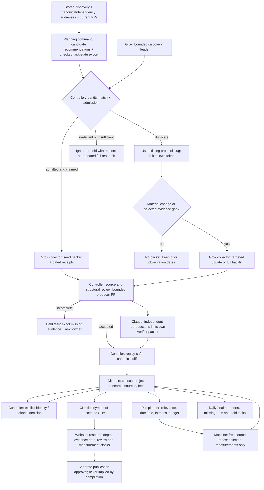

# Research to website: operating map

Mission: be the leading Robinhood ecosystem research tracker — depth for screen-bound analysts,
clarity for casual readers. Think specialist research publication, not a list of every trading ticker.

This is the shared ownership/timing map. [Ingestion](ingestion.md) defines the contract;
[admission](admission-policy.md) defines selection evidence; [daily registry](daily-registry.md)
defines implemented refresh budgets. Saving instructions does not start Grok, Claude or a schedule.

## Flow and responsibility

An independently launched token may have its own profile. A protocol's own token belongs to that
protocol; shared factories, collateral and launchpad relationships are sourced edges, not identity merges.
Admission is evidence-led: chain/address and official crosslinks first; platform recognition, own activity
and independent sources corroborate relevance. FOMO/CoinGecko presence alone neither admits nor rejects.

## Timing and stopping rules

The UTC cron expressions in `.github/workflows/` are authoritative. Chicago times below are CDT
(UTC−5); winter is one hour earlier. GitHub may delay runs. These are schedules, not freshness SLAs.

| Stage / owner | Trigger or timing | Budget / done condition |
| --- | --- | --- |
| Admission / controller | Before assigning a name | Suggested 5–10 min/name; match existing and pending identities, admit/hold/ignore with reason |
| Seed / Grok | Explicit finite assignment | Suggested 15–30 min/name; evidence floor passes or source gap is held |
| Full backfill / Grok | Relevant name with material missing depth | Suggested 45–90 min/name; all three verification passes, dated metrics or searched gaps |
| Targeted update / Grok | Material event, correction or selected measurement | Suggested 15–45 min/name; real delta, prior packet pointer, no check-only packet |
| Verification / Claude | Assigned claims from a different producer | Suggested 15–30 min/name; independent method/result/date/block, unresolved limitations retained |
| Machine pull / GitHub | 09:17 UTC / 04:17 CDT daily when enabled | 30 min work deadline, 45 min job timeout; report success, partial progress and retries separately |
| Compile / GitHub + controller | 11:47 UTC / 06:47 CDT daily, or authorized manual run | 30 min job timeout; accepted diff and per-packet disposition, not merely green execution |
| CI/deployment / GitHub + host | Accepted main change | Use actual run/deploy timestamps, not a promised duration; verify deployed SHA and changed public fields |
| Health / GitHub | 15:37 UTC / 10:37 CDT daily | 5 min timeout; inspect reports and missing work even when jobs are green |

Human/model times are proposed planning budgets, not measured performance or enforced automation.
If a read is blocked, record the failed surface and next useful check; do not exhaust the time budget
on identical retries. Machine retry limits and relevance lanes remain in the daily-registry implementation.
Active relevant names get priority; quiet names use slower lanes; dormant names are not fully researched
on every run. A successful API request is not proof of a new observation. Dune currently supports supplied
exports; no paid or automatic query execution is implied. External bot sessions remain separately controlled.

## Source of truth and the four clocks

Canonical Git content is the website's research source of truth; a bot chat or open packet PR is not live
data. Machine observations live separately under `content/pulled/`. Runtime review/storage facilities do
not make an uncompiled research packet public. Verify the accepted packet, canonical diff and deployed SHA.

| Field / state | Owner and exact meaning | Must not imply |
| --- | --- | --- |
| `research_state.as_of`, `work_id`, `tier` | Compiler: latest accepted packet's evidence cutoff and provenance | Independent review, today’s measurements or every field rechecked |
| `research_state.full_as_of` | Compiler: latest accepted full-tier packet on file | New evidence-floor compliance for historical packets, score approval or full coverage |
| `review.reviewed_at`, `review.approver` | Editorial/controller review; pending remains pending | A collector's latest research date |
| `coverage: full` and scoring | Explicit editorial decision; compiler preserves existing state | Automatic promotion because a full packet arrived |
| `identity.status` | Controller decision; collector cannot promote or clear a conflict | Source-level `verified` labels prove the whole identity |
| Metric `as_of` / measurement timestamp | Source observation window, preserved through ingestion | Pull execution or deployment date |
| Deployed SHA / deployment time | Host: version actually served | Fresh research for all profiles |

The website calls receipt availability “Project links on file”, not identity verification. Detailed research
can be on file while independent review is pending. Announced/inactive product lifecycle takes precedence
over a trading token's activity when rendering status.

## QA and handoff

For every bounded task record owner, main SHA, packet path/hash, source limitations, canonical result,
tests, PR/run URLs and disposition: accepted, held, rejected or transferred. Retire a producer PR only
after all its packets have an explicit disposition. Historical packets are immutable evidence: compiler
recovery belongs in a separately attributed packet, not an edit masquerading as the original producer.

Check representative names across categories and edge cases: full research awaiting review, announced
product with token trades, inactive product, conflicted identity, stale/missing measurements, and a new
seed. Run repository and site tests plus release validation. Existing legacy gaps remain a prioritized
backfill queue, not permission to invent data or force flags green.

The one-time research-state backfill derives only from packets at a pinned accepted main SHA:
`node scripts/migrate-research-state.mjs <40-character-main-sha> --check` (then authorized `--write`).
It refuses unrelated project edits and packet changes and never changes approval or identity fields.

## Where each rule lives

Start with three operating references: this map (owners/timing), [ingestion](ingestion.md)
(assignments, task state, public output and packet disposition), and [research system](research-system.md)
(evidence/identity/compiler contract). Specialized details remain in [admission](admission-policy.md)
and [daily registry](daily-registry.md); they do not define another lifecycle. Skills route to these
rules. Integration docs own provider submission recipes, not duplicated thresholds or flow instructions.

`node scripts/planning-inputs.mjs --issue 132` automates input preparation, not admission or bot dispatch.
Check the resulting reports and explicit task reservation before launching a finite collector run.
